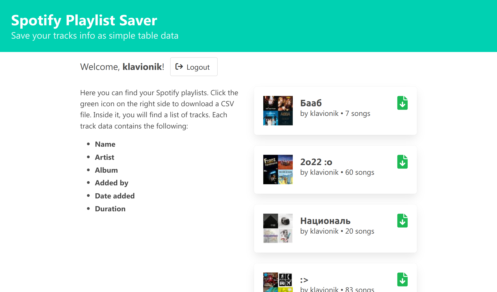

# Playlist Saver

Save your Spotify playlists as CSV data.



## Development
```shell
git clone git@github.com:Klavionik/spotify-playlist-saver.git
cd spotify-playlist-saver
cp .envrc.example .envrc # Add Client ID and Client secret from the Spotify Dev Dashboard
docker compose up -d
```
